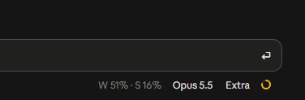
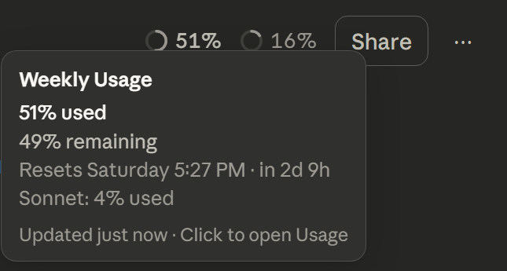
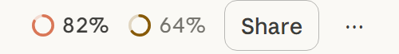
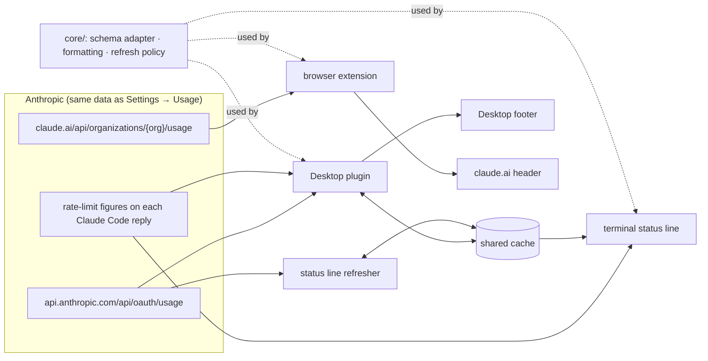

# Claude Usage Monitor

See your Claude plan usage (weekly and current session) without opening **Settings → Usage**.

| Where | What you see |
|---|---|
| Claude Code in a terminal | a status line: `W ◑ 51% ↻ Friday 9:59 PM · S ◔ 16%` |
| Claude Desktop, Code tab | `W 51% · S 16%` in the footer, beside the model picker |
| claude.ai (Chrome, Edge, Brave) | small progress rings in the header; hover for the details |

**Claude Desktop (Code tab footer)**



**claude.ai: rings in the header, details on hover** (test page styled with claude.ai's own stylesheet, sample numbers)





> **Unofficial.** Not made by, affiliated with or endorsed by Anthropic. It reads the same usage endpoints that Claude's own Usage page and Claude Code's `/usage` read. They are undocumented and may change; if they do, the indicators show `—` rather than breaking anything.

## Features

- **Exact figures, not estimates**: the same numbers as Settings → Usage, with each window's real reset time in your local time zone.
- **Weekly first**: weekly is always visible; on narrow windows session goes before weekly does.
- **Quiet until it matters**: neutral below 60%, then amber (60–79%), Claude's clay orange (80–94%) and red (95%+). Only the ring (or, in the Desktop footer, the percentage) takes the colour.
- **Native look**: Claude's own fonts, text colours and theme tokens; light and dark mode.
- **Light on the network**: every terminal and Desktop session shares one cache, so together they ask about once a minute. Usage also updates instantly from the rate-limit figures Claude Code already receives with each reply.
- **Fails quietly**: offline, signed out or an API error shows `W —`, keeps the last good figures and backs off (1 → 15 minutes). Claude itself is never affected.
- **Install once**: two entries in Claude Code's user settings and a one-time "Load unpacked" for the extension. It works in every project and survives restarts.

## How it works



- `core/` holds everything the three surfaces share: `usage-schema.mjs` is the only file that knows the payload shapes, `usage-format.mjs` turns them into labels, severities and tooltips, and `usage-cache.mjs` is the refresh and backoff policy.
- **Terminal**: a Claude Code status line (`statusline/`). It prints from stdin and the cache and never waits on the network; a detached `refresh.mjs` updates the cache when it is due.
- **Claude Desktop, Code tab**: a Claude Code plugin (`claude-code-plugin/`) that draws plain text into the composer footer's status slot.
- **claude.ai**: a Manifest V3 extension (`browser-extension/`). It draws in a closed shadow root outside the page's React tree and places itself by hit-testing the header rather than relying on generated class names; everything claude.ai-specific lives in `src/adapter.mjs`.

## Privacy and security

- **Desktop plugin:** never sees a credential. It asks Claude Code for an opaque handle (`$.session.authorize()`), and the engine attaches the login to the request itself.
- **Terminal refresher:** reads Claude Code's own login (`~/.claude/.credentials.json`) into memory only when the cache is due. It sends the login to `api.anthropic.com` alone, never logs it, and never refreshes or rewrites it.
- **Browser extension:** uses the page's own signed-in session for same-origin requests to claude.ai. Its background worker only watches request URLs, to refresh right after a reply finishes; it reads no request or response bodies.
- **Cache:** `cache/usage.json` holds usage figures only, never tokens.
- **No telemetry, no third parties.** Nothing is sent anywhere except Anthropic's own endpoints.

## Install (Windows)

**Only want the claude.ai part?** Download `claude-usage-monitor-extension-v1.0.0.zip` from the [latest release](https://github.com/CS-Abuhelal/claude-usage-monitor/releases/latest) and unzip it. Then open `chrome://extensions`, turn on **Developer mode**, click **Load unpacked** and choose the unzipped `claude-usage-monitor-extension` folder. No Node or install script needed.

For everything (status line, Desktop footer and extension):

Requirements:
- **Node.js 18+** on `PATH`, for the status line.
- **Claude Code** for the terminal status line.
- **Claude Desktop** for the Code-tab footer. It uses the plugin system of Claude Code's newer engine (bundled with the Desktop app); this was tested with 2.1.289.
- **Chrome, Edge or Brave** for the extension.

```powershell
git clone https://github.com/CS-Abuhelal/claude-usage-monitor "$HOME\.claude\usage-monitor"
powershell -ExecutionPolicy Bypass -File "$HOME\.claude\usage-monitor\install.ps1"
```

`install.ps1` copies `core/` into the plugin and the extension and runs the tests. It also adds two entries to `~/.claude/settings.json`, touching nothing else (your original file is backed up to `backup/`):
- `statusLine`: the terminal status line, refreshed every 30 s. An existing status line of yours is left as it is.
- `env.CLAUDE_CODE_PLUGIN_DIRS`: loads `claude-code-plugin/` in every Claude Code session. Other folders already listed are kept.

Then load the browser extension once:
1. Open `chrome://extensions` (or `edge://extensions`, `brave://extensions`).
2. Turn on **Developer mode**.
3. Click **Load unpacked** and choose the `browser-extension` folder.

New terminal sessions show the status line straight away; open a new Code session in Claude Desktop to see the footer.

## Update

Pull or edit, run `install.ps1` again (it is idempotent), then click the extension's reload arrow in `chrome://extensions`.

- If Anthropic renames a field, the fix goes in `core/usage-schema.mjs`.
- If claude.ai's header changes, the fix goes in `browser-extension/src/adapter.mjs`.

## Uninstall

1. Remove "Claude Usage Monitor" in `chrome://extensions`.
2. Run:

```powershell
powershell -ExecutionPolicy Bypass -File "$HOME\.claude\usage-monitor\uninstall.ps1"
```

It removes exactly its two settings entries and then deletes the folder.

## Customize

- **More metrics:** the data layer also reads cloud session credits and prepaid usage credits; they are just not displayed. Add `'cloud'` and/or `'credits'` to `VISIBLE_METRICS` in `core/usage-format.mjs` and run `install.ps1`.
- **Colour bands:** change `severityOf()` in the same file.

## Limitations

- **The Desktop Chat tab can't be modded** without defeating its protections, so this project doesn't. On Windows it is a signed, read-only app package (MSIX) with Electron's asar-integrity check on, and it refuses remote-debugging flags. The Code tab is supported through Claude Code's plugin system.
- **The Desktop footer slot is plain text**, capped at about 24 characters, so on Desktop there are no rings or hover details. The text shortens to `W 51%` when space runs out.
- **The plugin system is early access** in Claude Code and may change between releases. If the footer ever disappears after an update, the terminal and browser parts keep working.
- **Install scripts are PowerShell** (tested on Windows 11). The Node and browser parts are cross-platform.

## Project layout

```
core/                shared logic (edit here; install.ps1 copies it out)
statusline/          terminal status line + background refresher
claude-code-plugin/  Claude Desktop Code-tab footer (hooks/register.tsx, footer.ts, source.ts)
browser-extension/   claude.ai extension (Manifest V3)
scripts/             settings editor used by install/uninstall
tests/               node --test suites
docs/screenshots/    images used above
```

## Development

```powershell
node --test tests/core.test.mjs tests/statusline.test.mjs tests/configure.test.mjs
claude plugin validate claude-code-plugin
claude plugin test claude-code-plugin
```

The plugin commands need a Claude Code build with plugin modules (for example the one bundled with Claude Desktop).

## License

[MIT](LICENSE)
